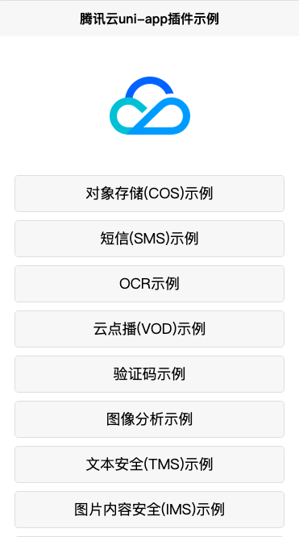

### uni-app腾讯云插件Example
使用说明参照：https://openapp.qq.com/docs/DCloudUni-app/asr.html#_3-%E5%AE%89%E8%A3%85%E6%8C%87%E5%BC%95 安装指引来进行配置

 

### docker build
1. docker build -t csighub.tencentyun.com/springrain/uni-app:镜像版本号 ./ 
2. 进行docker镜像上传 docker push csighub.tencentyun.com/springrain/uni-app:镜像版本号